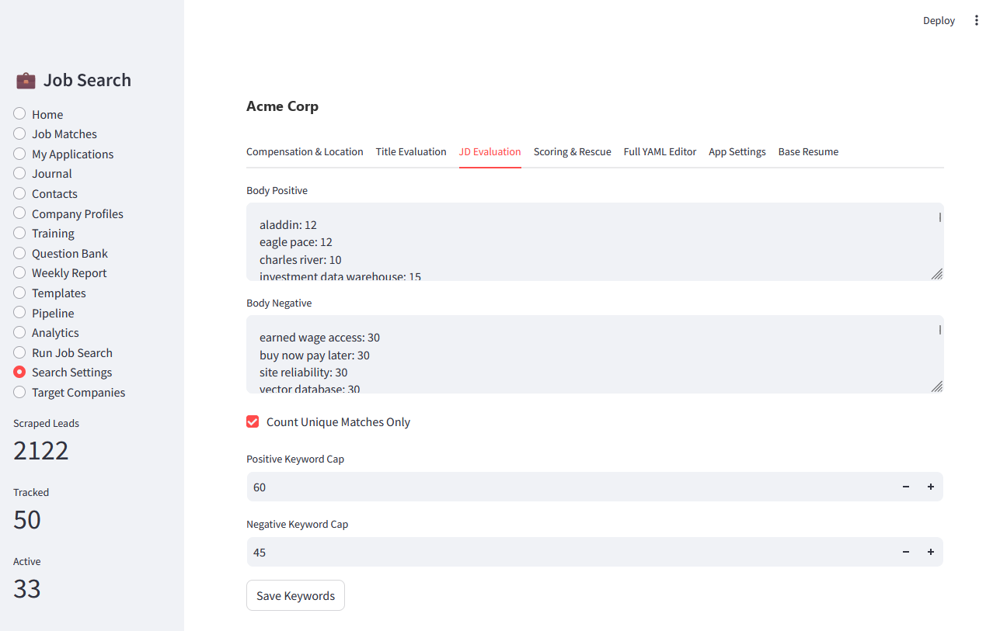
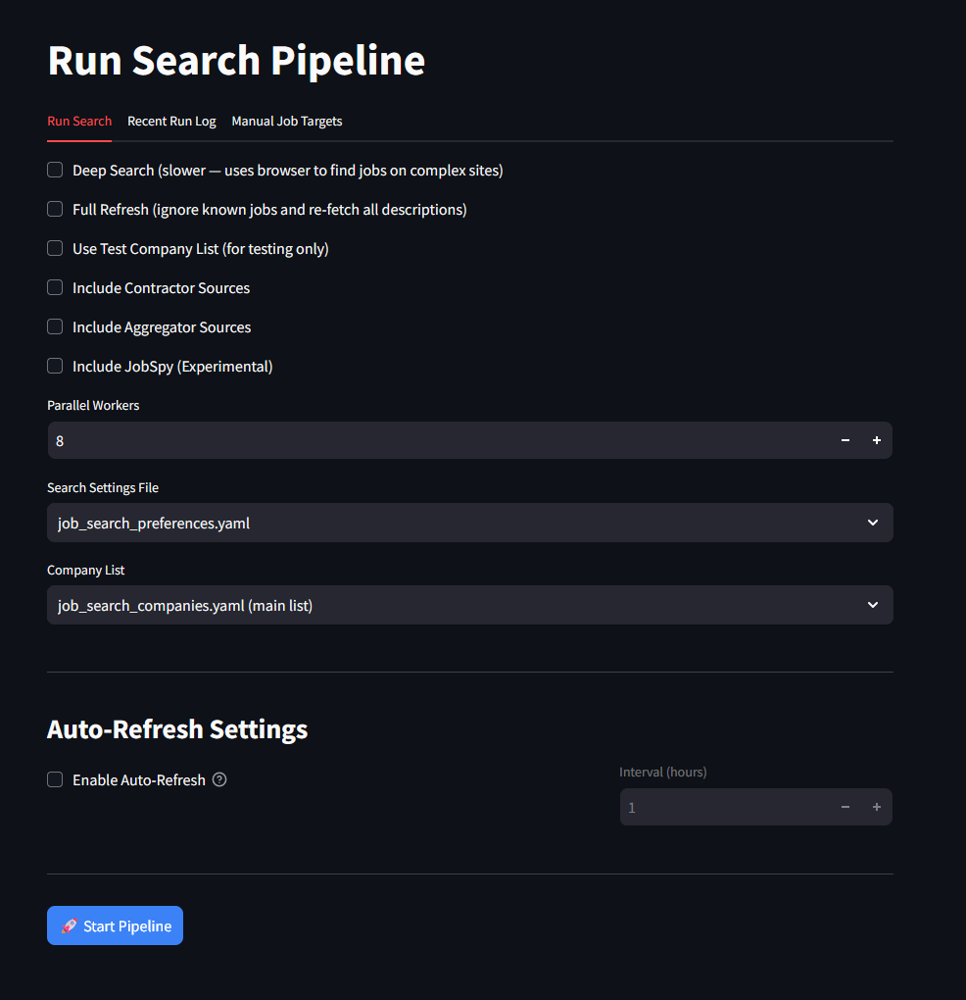

# Job Search Automation Platform — v2.0

A local job-search dashboard that discovers jobs from target companies, scores them against your preferences, and tracks your entire search in a single SQLite database — all on your own machine.

**[→ Full User Guide](USER_GUIDE.md)** — step-by-step walkthrough of every feature

---

## Screenshots

### Home — activity summary and pipeline at a glance


### Job Matches — scored roles with keyword breakdown


### Scoring — see exactly why a role ranked where it did


### My Applications — full pipeline with Gmail sync


### Application Detail — interview timeline, offer comparison, negotiation notes


### Pipeline — kanban view across all active applications


### Analytics — rejection patterns, keyword gaps, network leverage


### Resume Keyword Gap Analysis


### Weekly Activity Report


### Run Job Search — live scraper output


### Search Preferences & Scoring Settings


### Target Companies — company registry and scraper health


### Fix Job Listings — ATS healer


### Question Bank


### Rejection Analysis


---

## Installation

### Windows (recommended)

1. Download `JobSearchSetup.exe` from the [Releases](../../releases) page.
2. Run the installer — no admin rights needed, installs per-user.
3. Launch from the Desktop or Start Menu shortcut.

The installer bundles a Python runtime, pre-warms the virtual environment on first install, and handles upgrades cleanly from v1.6.

### Manual install

See [GETTING_STARTED.md](GETTING_STARTED.md).

```
1. Install Python 3.9+
2. Clone or download this repo
3. Run launch.bat (Windows) or bash launch.sh (macOS/Linux)
```

---

## What It Does

- Scrapes ~450 company careers pages across Greenhouse, Lever, Ashby, Workday, Rippling, and SmartRecruiters
- Supports a contractor sourcing lane with Dice and Motion Recruitment
- Scores jobs with a configurable model: ~25% title match, ~75% job description keyword alignment, with salary, location, and tier adjustments
- Shows a keyword breakdown on every job card so you know exactly why a role ranked where it did
- Tracks applications, contacts, interviews, offers, and rejections
- Syncs Gmail signals to detect missed interviews and application outcomes
- Stores your base resume for keyword gap analysis and per-application tailoring
- Includes offer comparison, negotiation planning, and interview debrief tools
- Automatically repairs stale company careers URLs via the ATS Healer

For a full walkthrough of every feature, see the **[User Guide](USER_GUIDE.md)**.

---

## CLI

```bash
# Run the scraper
python -m jobsearch.cli run

# Include contractor sources
python -m jobsearch.cli run --contract-sources

# Run ATS healing
python -m jobsearch.cli heal --all

# Launch the dashboard
python -m jobsearch.cli dashboard
```

---

## Deep Search (optional)

The `deep_search/` add-on uses Playwright and Chromium for JavaScript-heavy sites that the static scraper cannot reach.

```bash
# Windows install
deep_search\install_deep_search.bat

# Usage
python -m jobsearch.cli run --deep-search
python -m jobsearch.cli heal --deep --all
```

---

## Data and Logs

Everything stays local — nothing is sent to external services.

| File | Contents |
|---|---|
| `results/jobsearch.db` | All jobs, applications, contacts, resume, settings |
| `config/job_search_preferences.yaml` | Scoring preferences |
| `config/job_search_companies.yaml` | Target company registry |
| `config/job_search_companies_contract.yaml` | Contractor source registry |
| `results/job_search_v6.log` | Scrape run log |
| `results/ats_heal.log` | Healer run log |
| `results/job_search_v6_rejected.csv` | Score-rejected jobs |
| `results/job_search_manual_review.txt` | Bot-blocked companies for manual review |

**Backup:** copy `results/` and `config/job_search_*.yaml` to preserve all state.

---

## Troubleshooting

**No results are being kept**
- Lower the salary floor in `Search Settings → Compensation & Location`
- Relax title or keyword weights in `Search Settings → Job Title Settings`
- Inspect `results/job_search_v6_rejected.csv` to see what is being filtered and why

**Gmail sync fails**
- Use a Google App Password rather than your main account password
- Manage App Passwords at `https://myaccount.google.com/apppasswords`
- Enter credentials in `Search Settings → App Settings`

**Resume gap analysis is empty**
- Upload your resume in `Search Settings → Base Resume`
- Rerun the scraper so matched keywords are current

**Companies are blocked or stale**
- Open `Target Companies → Fix Job Listings` to run the ATS healer
- Review `Target Companies → Scraper Health` to see consecutive-failure counts
- Check `results/job_search_manual_review.txt` for confirmed bot-blocked sites

See **[USER_GUIDE.md](USER_GUIDE.md)** for detailed guidance on all workflows.
