# User Guide — v2.0

This guide covers daily use of the Job Search dashboard — from first-time setup through running searches, tracking applications, prepping for interviews, and analyzing your results.

**What's new in v2.0:** Score breakdowns on every job card, ghosted application alerts on the home dashboard, a Scraper Health panel showing which companies have gone dark, keyword search across all Job Matches tabs, Search Settings controls for title-vs-JD weighting, a re-score button for saved jobs, and YAML-driven bucket thresholds so your Search Settings preferences control the Apply Now / Review Today / Watch cutoffs directly.

---

## Contents

1. [What This App Does](#1-what-this-app-does)
2. [Installation and Launch](#2-installation-and-launch)
3. [First-Time Setup](#3-first-time-setup)
4. [Finding Jobs — The Scraper](#4-finding-jobs--the-scraper)
5. [Job Matches](#5-job-matches)
6. [My Applications — Tracking Your Pipeline](#6-my-applications--tracking-your-pipeline)
7. [Pipeline View](#7-pipeline-view)
8. [Home Dashboard](#8-home-dashboard)
9. [Analytics](#9-analytics)
10. [Company Profiles](#10-company-profiles)
11. [Contacts](#11-contacts)
12. [Interview Question Bank](#12-interview-question-bank)
13. [Email Templates](#13-email-templates)
14. [Journal](#14-journal)
15. [Training Tracker](#15-training-tracker)
16. [Weekly Report](#16-weekly-report)
17. [Search Settings Reference](#17-search-settings-reference)
18. [Target Companies Reference](#18-target-companies-reference)
19. [CLI Reference](#19-cli-reference)
20. [Tips and Workflow](#20-tips-and-workflow)
21. [Troubleshooting](#21-troubleshooting)

---

## 1. What This App Does

The dashboard is a self-hosted job search system that combines three things most job seekers manage in separate tools:

- **Automated discovery** — scrapes careers pages at your target companies daily or on demand, scores every role against your salary, location, and keyword preferences, and surfaces only the matches that meet your bar.
- **Application CRM** — tracks every application through a full stage workflow (exploring → applied → screening → interviewing → offer), logs events, manages contacts, and schedules follow-ups.
- **Preparation and analysis** — interview question bank, company research profiles, email templates, a personal journal, and analytics that show where you're converting and where you're stalling.

Everything stays local. No data leaves your machine.

If the dashboard has been useful in your search, you can support ongoing development here:

[Buy Me a Coffee](https://www.buymeacoffee.com/ericdipietro)

---

## 2. Installation and Launch

### Windows (installer)

1. Download `JobSearchSetup.exe` from the Releases page.
2. Run the installer and follow the prompts.
3. Launch from the Desktop or Start Menu shortcut.

### Manual (any platform)

1. Install Python 3.9 or newer and make sure it is on `PATH`.
2. Clone or download this repo.
3. Run the appropriate launcher:
   - Windows: `launch.bat`
   - macOS: `launch.command`
   - Linux: `bash launch.sh`

On first launch the launcher creates a virtual environment, installs dependencies, and copies the example preferences file if none exists. The dashboard opens automatically at `http://localhost:8501`. If it doesn't, open that URL in your browser.

---

## 3. First-Time Setup

When you first open the app, the Home page shows a setup checklist. Work through it top to bottom before running your first search.

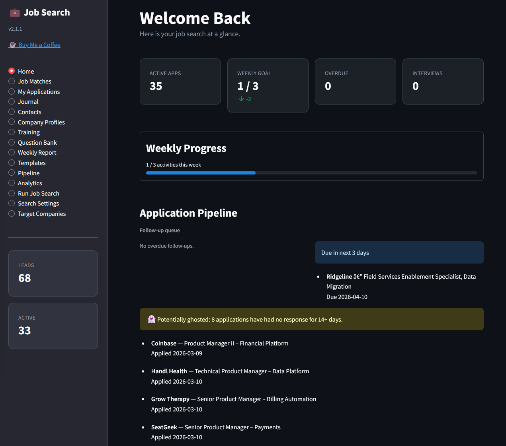

### Step 1 — Configure Search Settings

Open **Search Settings** in the left sidebar. There are five tabs:

**Compensation & Location**
- Set your salary floor (`min_salary_usd`) — jobs below this are scored down or filtered out.
- Set your target salary (`target_salary_usd`) — used for bonus/penalty calculations.
- Choose `remote_only` or `us_only` as appropriate.
- **Contractor Preferences** — if you're open to contract roles, enable them here and set your default hours/week, benefits gap, and 1099 overhead percentage. The scorer uses these to normalize hourly rates to an annual equivalent so you can compare contract and FTE roles on equal footing.

**Job Title Settings**
- Add positive title keywords with weights (e.g. `solutions architect: 10`, `staff engineer: 8`).
- Add `negative_disqualifiers` — titles containing these are dropped before scoring (e.g. `product`, `meet the staff`, `blog`).
- Set `must_have_modifiers` if you only want senior-level roles.

**Job Description Keywords**
- `Keywords That Boost Score` — keywords in the job description that raise your score (e.g. `api design`, `platform`, `fintech`).
- `Keywords That Reduce Score` — keywords that lower your score (e.g. `javascript`, `ruby`, `excel`).

**Scoring Settings**
- `minimum_score_to_keep` — jobs scoring below this go to the rejected CSV. Start at 35 and adjust after your first run.
- `Maximum Score From Title Match` — caps total title contribution, which lets you dial title-vs-JD weighting without editing YAML.
- `Maximum Score From JD Keywords` — caps how much the job description can add to the score.
- `Maximum Penalty From JD Negative Keywords` — caps how much JD negatives can subtract.
- Adjustment parameters for missing salary, salary bonuses, and contract role penalties.
- `Re-score Saved Jobs` — re-evaluates currently saved job matches using your latest settings without rerunning the scraper.

**Advanced Editor**
- Direct access to the raw preferences YAML for power users.

### Step 2 — Add Target Companies

Open **Target Companies** → **Add / Edit** tab.

At minimum, provide:

| Field | Description |
|---|---|
| `name` | Company name |
| `careers_url` | Direct link to their jobs board |
| `Job Board Type` | ATS type: `greenhouse`, `lever`, `ashby`, `workday`, `rippling`, `smartrecruiters`, `generic` |
| `Job Board Identifier` | The unique slug used by the ATS (e.g. `stripe` for `jobs.ashbyhq.com/stripe`) |
| `tier` | 1 = top target, 2 = strong, 3 = good, 4 = stretch |

If you don't know the adapter or key, set the adapter to `generic` and run **Fix Job Listings** — it will probe the page and try to identify the correct ATS automatically.

### Step 3 — Run Fix Job Listings

Before your first search, go to **Target Companies** → **Fix Job Listings** and run it on all companies. This verifies that careers URLs are live and corrects any misclassified adapters. Companies with broken boards are marked inactive and added to `results/job_search_manual_review.txt` for manual follow-up.

### Step 4 — Run Your First Search

Go to **Run Job Search** in the sidebar and click **Run**. The scraper checks every active company, fetches open roles, scores them, and saves matches to the database.

---

## 4. Finding Jobs — The Scraper

### How Scoring Works

Every job goes through a funnel:

1. **Soft-drop** — titles matching `negative_disqualifiers` are discarded immediately.
2. **Title scoring** — your `title_positive_weights` keywords are matched against the job title. A weight ≥ 8 triggers a Fast-Track base score of 50 points.
3. **JD scoring** — `Keywords That Boost Score` and `Keywords That Reduce Score` keywords are matched against the full description.
4. **Tier bonus** — Tier 1 companies add 15 pts, Tier 2 adds 8 pts, Tier 3 adds 4 pts.
5. **Location filter** — non-local onsite/hybrid roles are hard-filtered out. International remote roles are filtered based on your location settings.
6. **Compensation adjustment** — salary at or above target adds pts; salary below floor deducts pts; missing salary is configurable.
7. **Contract adjustment** — contract roles are scored, filtered, and normalized based on your contractor preferences.

Scores map to fit bands: **Strong Match** (85+), **Good Match** (70+), **Fair Match** (50+), **Weak Match** (35+), **Poor Match** (below 35). Jobs below `minimum_score_to_keep` are written to `results/job_search_v6_rejected.csv` and not shown in the dashboard.

### Running Options

| Mode | When to use |
|---|---|
| Standard run | Daily use — fast, covers all active companies |
| `--deep-search` | Sites that require JavaScript rendering (Playwright/Chromium required) |
| `--contract-sources` | Adds contractor-specific job boards to the standard run |

### ATS Healing

Run **Fix Job Listings** periodically (weekly is usually enough) to catch companies that have changed their board URL or moved ATS providers. The healer probes each company and attempts to repair stale entries automatically. Companies it cannot resolve are routed to manual review.

---

## 5. Job Matches

The **Job Matches** page shows all scraped jobs that passed the scoring threshold, sorted by score descending.

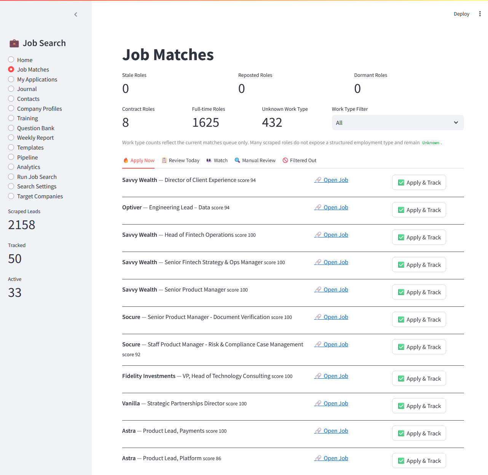

**Key columns:**
- **Score / Band** — numeric score and fit band label
- **Matched / Penalized** — the specific keywords that drove the score up or down
- **Compensation** — raw salary range if posted, plus normalized annual equivalent for contract roles
- **Work Type** — FTE, W2 hourly, 1099, or C2C
- **Posted / Velocity** — how long the role has been open; *Stale* or *Recurring* roles signal leverage or problems
- **Status** — current disposition (New, Considering, Applied, etc.)

**Tabs on this page:**
- **Apply Now** — top-priority roles that meet your strongest criteria
- **Review Today** — strong roles worth reviewing today
- **Watch** — near-miss roles or roles you manually promoted into a follow-up queue
- **Manual Review** — scraper/manual queue for companies the scraper could not resolve cleanly
- **Filtered Out** — low-fit saved jobs plus the latest rejected-search output

**Actions from this page:**
- Click a role to open the detail panel
- Change status directly in the table to move it into the tracker
- Use **Filtered Out -> Move To** to promote false negatives into `Watch`, `Review Today`, or `Apply Now`

---

## 6. My Applications — Tracking Your Pipeline

The **My Applications** tracker is the core CRM. Every application you actively pursue lives here.

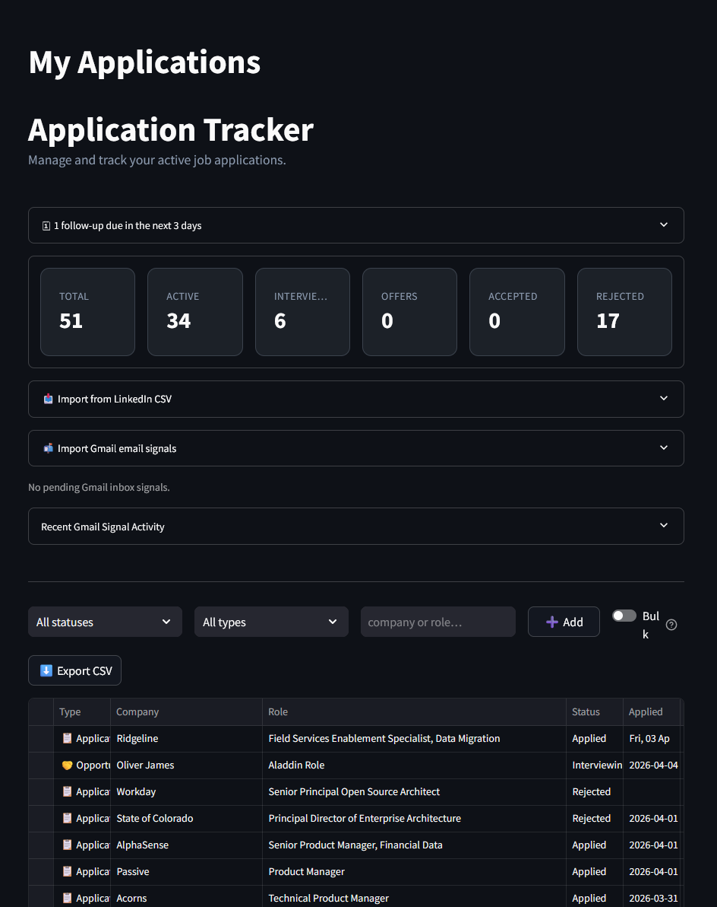

### Stage Workflow

```
Exploring → Considering → Applied → Screening → Interviewing → Offer → Accepted / Rejected / Withdrawn
```

Move an application to the next stage using the status dropdown. The stage history is recorded automatically with timestamps.

### Application Detail

Expanding an application shows tabbed sections:

**Overview**
- Role details, location, compensation, work type, normalized annual comp
- Fit score and matched/penalized keywords
- Links to the job posting, your resume version, and cover letter

**Events**
- Log any interaction: applied, recruiter outreach, phone screen scheduled/complete, interview scheduled/complete, offer received, offer negotiating, follow-up sent, note
- Each event is timestamped and shown in a chronological feed
- Gmail-detected events are imported automatically and shown inline

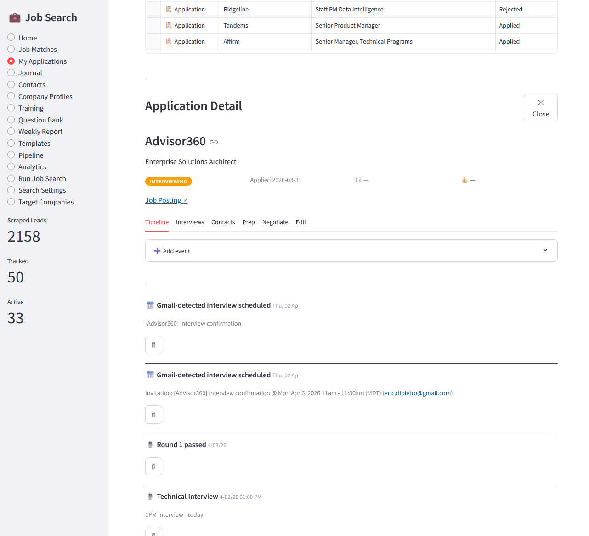

**Follow-up**
- Set a follow-up date and note
- The Home dashboard surfaces overdue follow-ups prominently
- Default follow-up windows: 7 days after applying, 3 days after screening, 2 days after interview or offer

**Contacts**
- Add the people involved in this process: recruiter, hiring manager, panelists
- Store name, email, phone, LinkedIn URL, and role in the process

**Interview Prep**
- Free-text fields for: Why this company, Why this role, Tell me about yourself (tailored version)
- Space for questions to ask them
- Links to your relevant STAR stories from the Question Bank
- **Interview Debrief** — after each interview, capture how it went, signals you noticed (did they mention a start date? did they move quickly?), and your own read on fit. Over time this correlates with outcomes.

**Resume Tailoring**
- Compares your stored base resume against the role's JD keywords
- Highlights gaps — terms that appear in the JD but not your resume
- Lets you draft a tailored version per application without touching your master copy
- Set up your base resume in **Search Settings → Base Resume**

**Offer Details**
- When you reach offer stage, record: base, bonus %, equity, signing, PTO, 401k match, remote policy, start date, offer expiry
- Normalized total comp is calculated automatically for comparison across FTE and contract roles

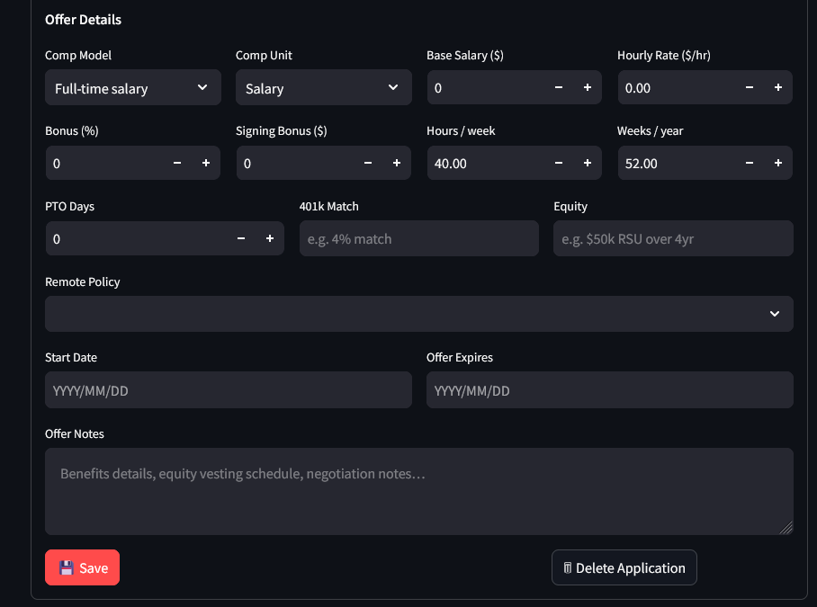

**Offer Comparison & Negotiation**
- Side-by-side total comp comparison across multiple offers
- Negotiation worksheet: your floor, your target, the posted range, days the role has been open (leverage signal), and a counter-offer note field
- Offer expiry dates are surfaced prominently on the Home dashboard

**Company Notes**
- Pulls in any existing Company Profile for this employer

**Gmail Sync**
- Sync your Gmail inbox to auto-detect interview requests, rejections, and recruiter messages
- Signals are classified and mapped to event types automatically
- Set up credentials in **Search Settings → App Settings** using a Google App Password

### Follow-up Reminders

The tracker automatically calculates follow-up due dates based on current stage. Overdue items appear as warnings on the Home page. You can override the date or add notes for any follow-up.

---

## 7. Pipeline View

**Pipeline** shows a tabular Kanban across active stages (Applied, Screening, Interviewing, Offer). Use it for a quick status sweep across all live applications. You can change status directly from the table.

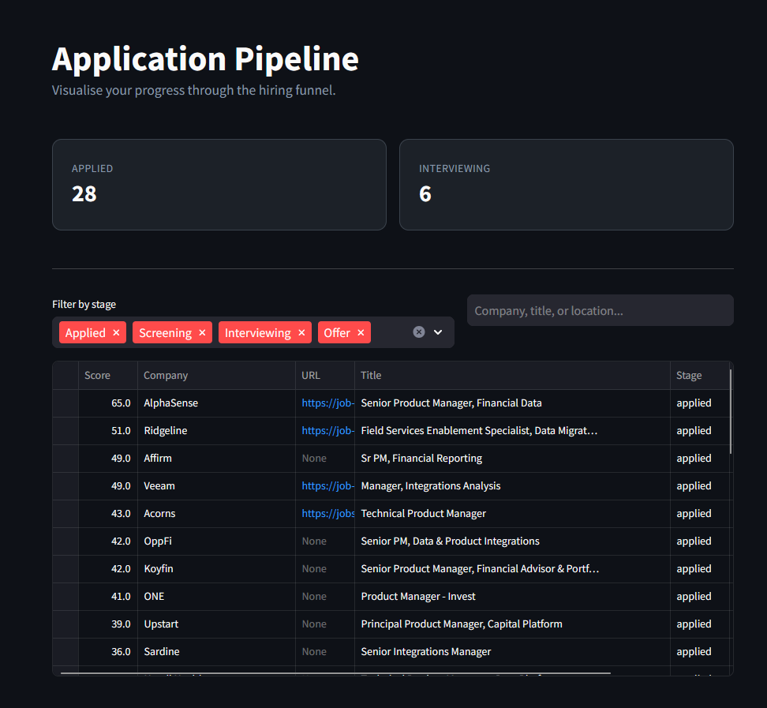

The view also shows time-in-stage for each application. Applications stuck in the same stage for more than 7 days are highlighted — a signal to follow up or move on.

---

## 8. Home Dashboard

The Home page gives an at-a-glance status of your search:

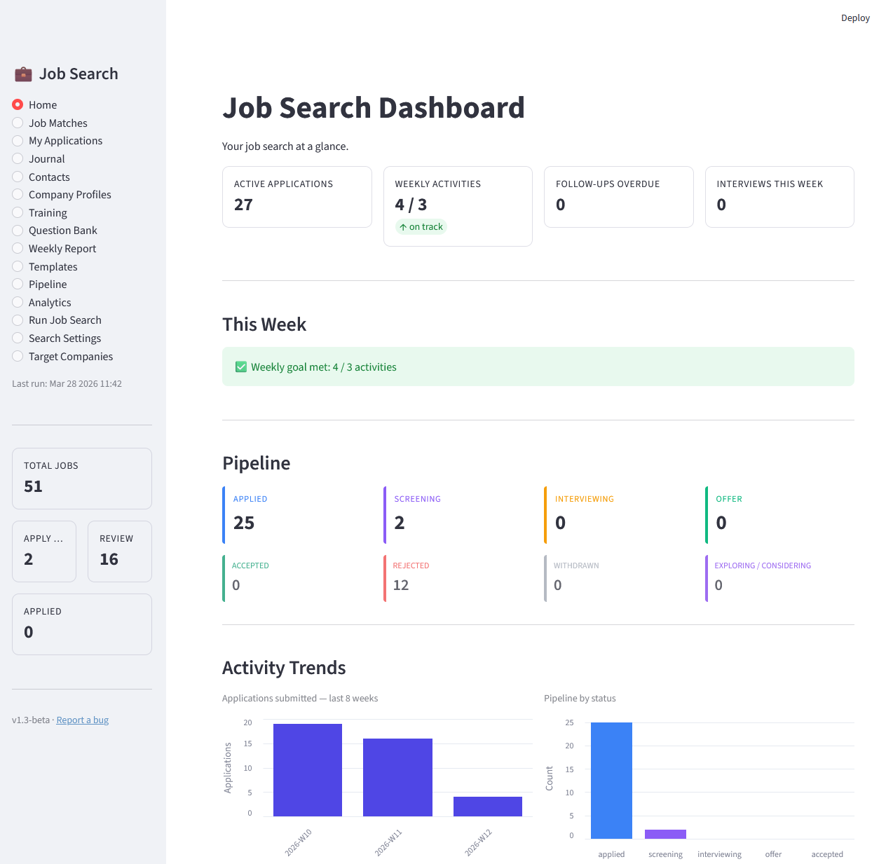

- **Overdue follow-ups** — applications past their follow-up date, with one-click links
- **Active pipeline count** — how many roles are in each active stage
- **Weekly activity goal progress** — compared to your configured weekly targets
- **Recent events** — the last 20 logged events across all applications
- **Setup checklist** — shown until all setup steps are complete

---

## 9. Analytics

The **Analytics** page shows where your search is working and where it isn't.

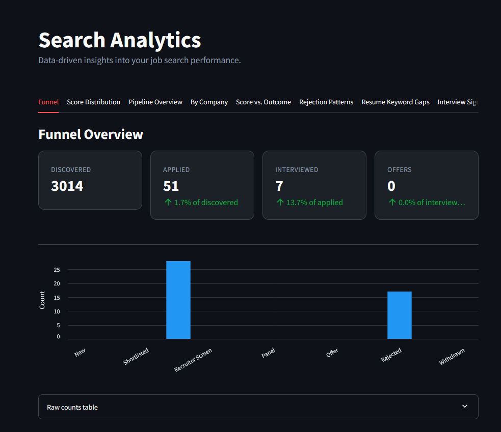

**Funnel counts** — how many applications are in each stage, and cumulative totals.

**Conversion rates** — the percentage progressing between each stage pair. If your Applied → Screening conversion is low, your targeting may be off. If Screening → Interviewing is low, your phone presence may need work.

**Average score by stage** — if you're getting interviews on low-scoring roles and rejection on high-scoring ones, recalibrate your scoring weights.

**Time in stage** — median days spent in each stage. Long times in Interviewing often mean ghosting; follow up.

**High-score, not applied** — roles that scored well but you haven't acted on. A useful queue for outreach.

**Score vs. outcome** — scatter plot of your score at application versus final outcome (interview, offer, rejected). Over time this shows whether your scoring predicts success.

**Company pipeline** — how many applications, interview rounds, and stage outcomes each company has produced.

**Lifecycle outcomes** — shows how far each application got before ending in rejection, ghosting, offer, or acceptance, plus company-level summaries of interview rounds and farthest stage reached.

**Rejection Pattern Analysis** — after enough data, surfaces which companies and title families are consistently rejecting you, and what penalty signals appear most often.

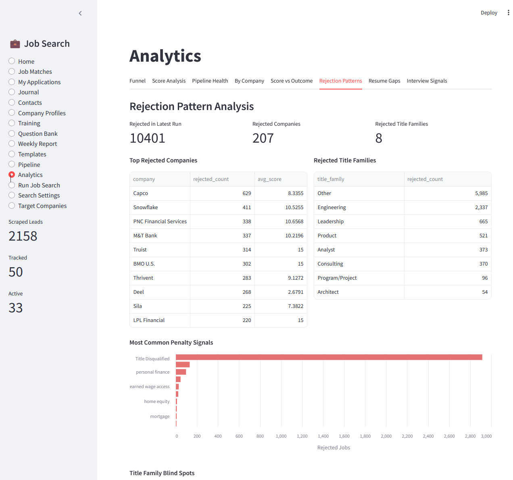

**Resume Keyword Gap Analysis** — compares your stored base resume against all matched roles to surface the most common JD terms you're missing.

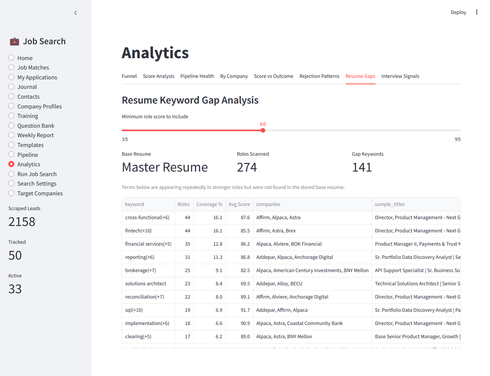

**Rejected jobs browser** — review the jobs that were scored out. Useful for tuning your `minimum_score_to_keep`.

---

## 10. Company Profiles

**Company Profiles** stores durable research notes about each employer — separate from any specific application. A profile written once appears automatically in every application to that company.

Fields available:
- Website, LinkedIn, Glassdoor links
- Culture notes, interview process notes
- Red flags
- Your overall interest rating

The **Network Map** at the top of the page shows, for each company that has contacts, your leverage score — a composite of how many contacts you have there, whether you've reached out, and whether any are marked as referrals.

---

## 11. Contacts

**Contacts** is your general networking contact book — not tied to specific applications.

For each contact you can store:
- Name, company, role, relationship type (former colleague, recruiter, mentor, referral, friend)
- Email, phone, LinkedIn URL
- Last contact date and next follow-up date
- Notes

**Follow-up reminders** appear at the top of the page when contacts are overdue. Clicking the email icon opens a mailto link pre-addressed to that contact.

---

## 12. Interview Question Bank

The **Question Bank** is your behavioral interview story library. Write a STAR answer once and reuse it across every interview.

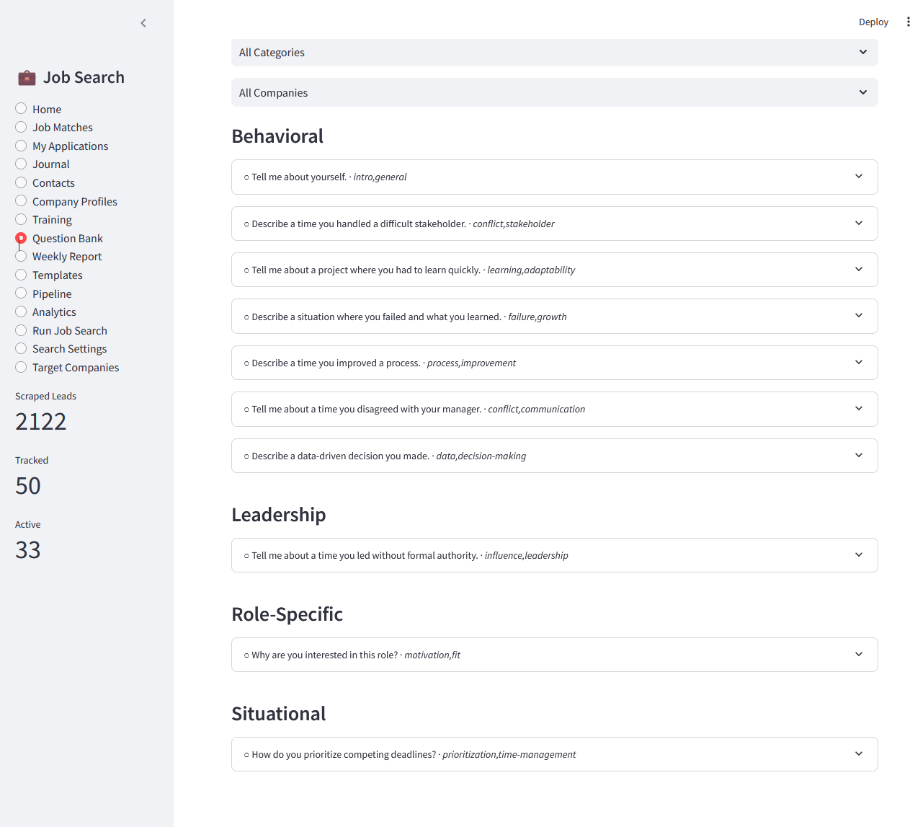

### Categories

- Behavioral, Situational, Leadership, Role-Specific, Technical, Other

### STAR Structure

Each answer has four fields:

| Field | Prompt |
|---|---|
| Situation | Set the scene. What was the context? |
| Task | What was your responsibility? |
| Action | What did YOU specifically do? (use "I", not "we") |
| Result | What was the outcome? Quantify where possible. |

### Linking to Applications

Questions can be tagged to a specific company and role, or kept general. When you open an application's Interview Prep tab, the relevant question bank entries are linked from there.

---

## 13. Email Templates

**Templates** stores reusable messages for every stage of the process.

Available types: Follow-Up, Thank You, Networking, Recruiter Response, Offer, Withdrawal, Other.

### Variables

Use these placeholders in your template text — they are substituted when you render the template:

| Placeholder | Replaced with |
|---|---|
| `{company}` | Company name |
| `{role}` | Role title |
| `{contact_name}` | Contact's name |
| `{my_name}` | Your name |

Default templates for follow-up and thank you are pre-loaded. Edit them or add your own.

---

## 14. Journal

The **Journal** is a private daily log. Use it to capture:
- Decisions made (why you withdrew, why you're prioritizing one offer)
- How you're feeling about the search
- Things to remember for next week

Each entry has an optional mood tag: Energized, Good, Neutral, Low, Frustrated, Uncertain. This isn't surfaced in analytics — it's for you.

---

## 15. Training Tracker

**Training** tracks any courses, certifications, or skill-building programs you're working on during the search.

Fields: provider, course name, category, status, start/end dates, URL, notes.

Status options: Planned, In Progress, Completed, Paused.

Useful for keeping your resume and interview prep current as you learn, and for demonstrating active professional development during long searches.

---

## 16. Weekly Report

**Weekly Report** generates a structured activity log for any date range.

Originally designed to simplify unemployment benefit paperwork — the report lists every logged event (applications submitted, calls made, interviews attended) in the format those forms typically require.

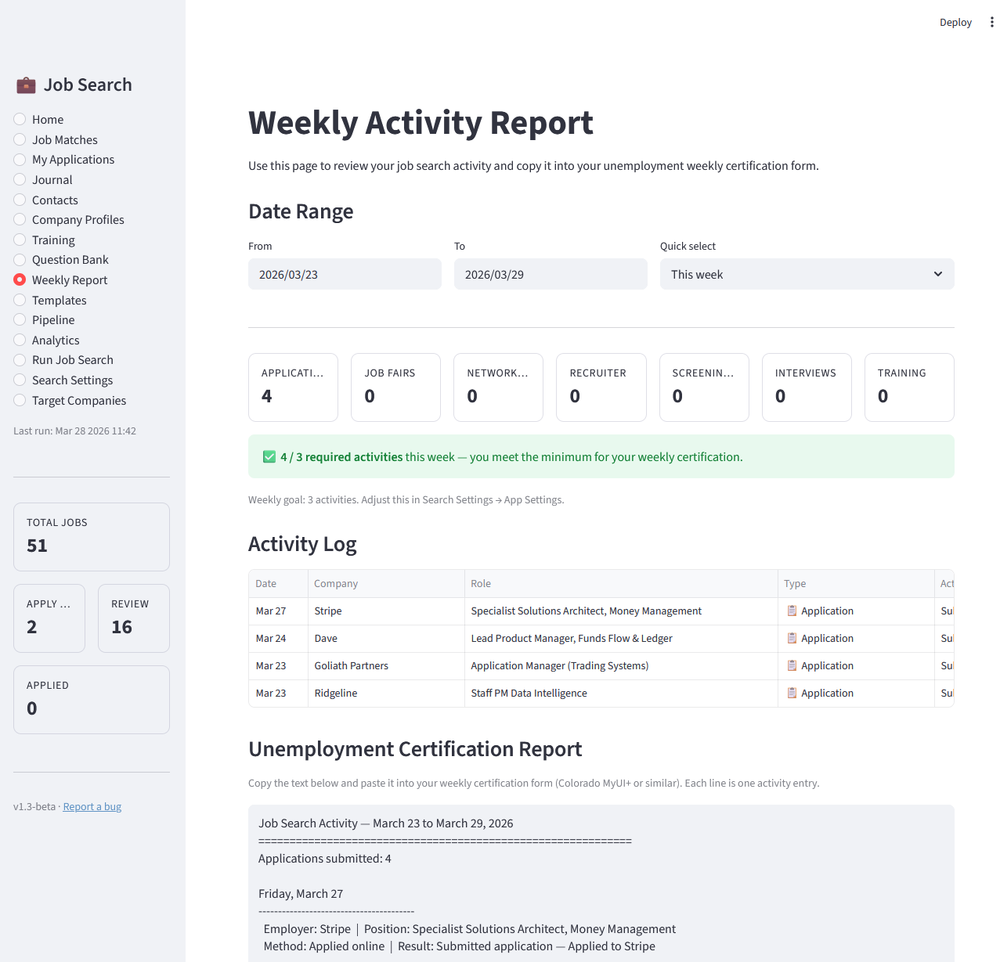

Select a date range and export the table directly. All event types are translated to human-readable descriptions (e.g. `interview_complete` → *In-person / video interview*). The report also dedupes scheduled/completed interview pairs so the same interview round is not counted twice.

---

## 17. Search Settings Reference

### JD Evaluation — Positive and Negative Keywords

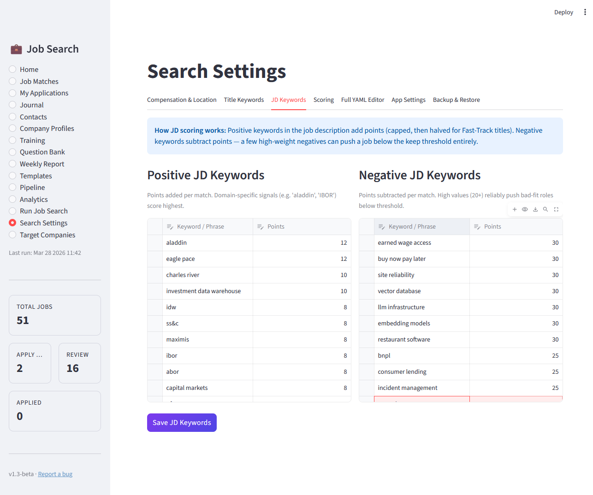

### Compensation & Location

| Setting | Description |
|---|---|
| `min_salary_usd` | Hard floor — salary below this triggers a score penalty |
| `target_salary_usd` | Your actual target — salary at or above this adds a bonus |
| `allow_missing_salary` | Whether to penalize roles with no salary posted |
| `remote_only` | Only consider remote roles |
| `us_only` | Filter out non-US locations |
| `allow_international_remote` | Permit remote roles outside the US |

For location-sensitive searches, non-local onsite/hybrid roles are treated as a hard filter. If you change location settings, use **Re-score Saved Jobs** to update existing Job Matches immediately.

### Contractor Settings

| Setting | Description |
|---|---|
| `include_contract_roles` | Whether to score contract roles at all |
| `allow_w2_hourly` | Accept W2 hourly contracts |
| `allow_1099_hourly` | Accept 1099 and C2C contracts |
| `default_hours_per_week` | Used to annualize hourly rates (default 40) |
| `default_w2_weeks_per_year` | Billable weeks assumed for W2 (default 50) |
| `default_1099_weeks_per_year` | Billable weeks assumed for 1099 (default 46) |
| `benefits_replacement_usd` | Annual cost to self-fund benefits on 1099 (default $18,000) |
| `w2_benefits_gap_usd` | Benefits shortfall on W2 hourly vs. FTE (default $6,000) |
| `overhead_1099_pct` | SE tax and overhead rate for 1099 (default 18%) |

### Scoring Adjustments

| Setting | Description |
|---|---|
| `minimum_score_to_keep` | Jobs below this are rejected to CSV |
| `title_max_points` | Maximum score contribution from title matching |
| `positive_keyword_cap` | Maximum score contribution from JD-positive keywords |
| `negative_keyword_cap` | Maximum penalty from JD-negative keywords |
| `missing_salary_penalty` | Points deducted when no salary is posted |
| `salary_at_or_above_target_bonus` | Bonus points when comp meets or exceeds target |
| `salary_meets_floor_bonus` | Smaller bonus when comp meets the floor but not target |
| `salary_below_target_penalty` | Deduction when comp is below the floor |
| `contract_role_penalty` | Additional penalty for contract roles (0 = no penalty) |
| `contractor_target_bonus` | Bonus for contract roles where normalized comp meets target |

---

## 18. Target Companies Reference

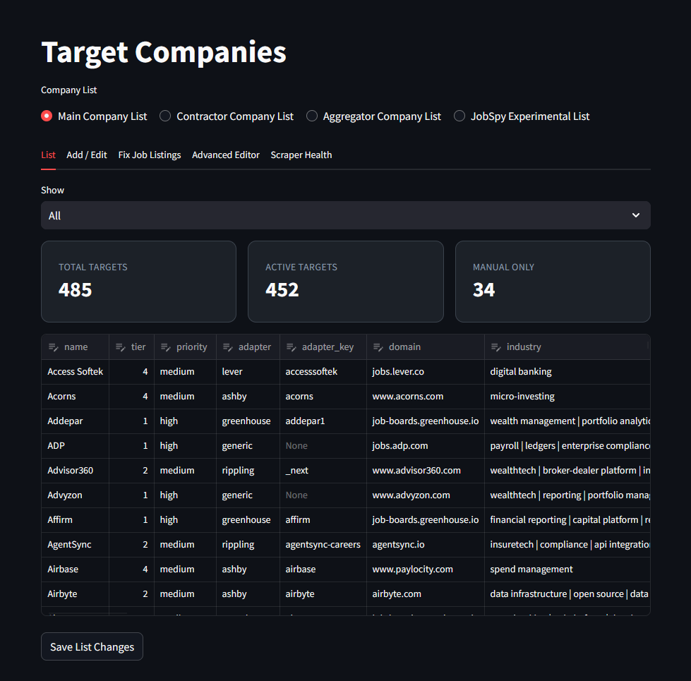

### Company Fields

| Field | Required | Description |
|---|---|---|
| `name` | Yes | Display name |
| `careers_url` | Yes | Direct link to the jobs board |
| `Job Board Type` | Yes | ATS type (see below) |
| `Job Board Identifier` | Recommended | ATS-specific slug for API-first scrapers |
| `domain` | Recommended | Used for domain-matching in generic scrapes |
| `tier` | Yes | 1–4 priority (1 = top target) |
| `active` | — | Set to `false` to pause scraping without deleting |
| `heal_skip` | — | Set to `true` to exclude from automated healing |

### Supported Adapters

| Adapter | ATS / Platform |
|---|---|
| `greenhouse` | Greenhouse (API and embed) |
| `lever` | Lever |
| `ashby` | Ashby |
| `workday` | Workday (probes wd1–wd25 subdomains) |
| `rippling` | Rippling ATS |
| `smartrecruiters` | SmartRecruiters |
| `generic` | Any careers page without a supported ATS |

### Fix Job Listings

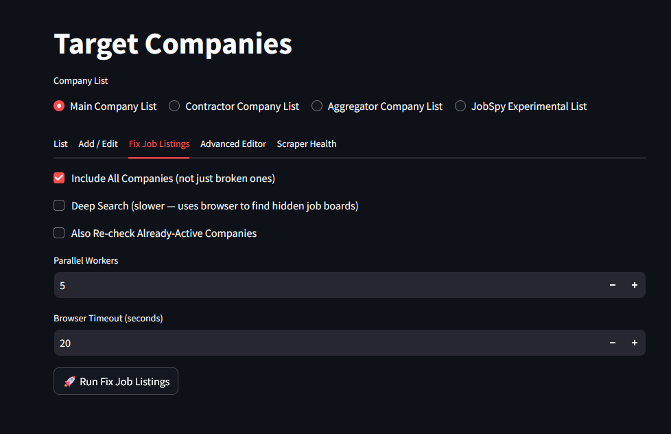

The healer probes each company's careers URL and attempts to:
- Confirm the board is live
- Identify the correct ATS type
- Correct the `adapter` and `Job Board Identifier` if wrong
- Deactivate companies whose boards are dead or blocked

Companies flagged as **blocked** (Cloudflare or similar anti-bot pages) are routed to `results/job_search_manual_review.txt` — check these manually rather than retrying automatically.

---

## 19. CLI Reference

All CLI commands run from the repo root with the virtual environment active.

```bash
# Run the scraper (standard)
python -m jobsearch.cli run

# Run with deep search (Playwright, slower)
python -m jobsearch.cli run --deep-search

# Include contractor sources
python -m jobsearch.cli run --contract-sources

# Both
python -m jobsearch.cli run --deep-search --contract-sources

# Run ATS healing on all companies
python -m jobsearch.cli heal --all

# Run healing with deep Playwright probing
python -m jobsearch.cli heal --deep --all

# Launch the dashboard
python -m jobsearch.cli dashboard
```

---

## 20. Tips and Workflow

### Suggested Daily Routine

1. Open the **Home** dashboard — check overdue follow-ups first.
2. Log any events from yesterday (emails received, calls made).
3. Check **Job Matches** for new roles from last night's scraper run.
4. Move any roles worth pursuing to *Considering* or *Applied*.

### Suggested Weekly Routine

1. Run the scraper — or schedule it via the CLI.
2. Run **Fix Job Listings** to catch stale boards.
3. Review the **Analytics** funnel — are conversion rates moving?
4. Check **High-score, not applied** in Analytics for roles you've been sitting on.
5. Generate a **Weekly Report** if you need to document activity.
6. Add new STAR stories to the **Question Bank** while they're fresh.

### Getting More Matches

If your first run returns few results:
- Lower `min_salary_usd` and `minimum_score_to_keep` temporarily.
- Add more `Keywords That Boost Score` keywords from job descriptions of roles you liked.
- Reduce the weight threshold on `title_positive_weights`.
- Run Fix Job Listings first — stale board URLs return zero results.

### Tuning Scoring Over Time

After 20–30 applications, open **Analytics → Score vs. Outcome**. If low-scoring roles are getting interviews, raise `minimum_score_to_keep`. If high-scoring roles are consistently getting rejected at first contact, reconsider your title weights or keyword choices.

### Using Tier Effectively

- Tier 1 companies get a 15-point score bonus — use this sparingly for companies you'd genuinely prioritize an offer from.
- Tier 4 companies get no bonus and should represent your aspirational list or fallbacks.
- Changing a company's tier re-scores all its jobs on the next scraper run.

### Contractor Roles

When a contract role appears, the scraper attempts to detect the work type from the title and description (`w2_contract`, `1099_contract`, `c2c_contract`, or `fte`). The normalized annual compensation accounts for benefits gaps and self-employment overhead, so a $95/hr 1099 role and a $175K FTE role appear on the same scale in the score.

If a role's work type is wrong, you can correct it in the application detail panel.

---

## 21. Troubleshooting

### Dashboard doesn't open
Browse directly to `http://localhost:8501`.

### No matches after a run
- Check `results/job_search_v6_rejected.csv` — jobs may be scoring out. Lower `minimum_score_to_keep`.
- Check `results/job_search_v6.log` for adapter errors or zero-result companies.
- Run Fix Job Listings — stale board URLs silently return nothing.

### Companies keep going inactive
The healer deactivates companies when their board returns no results or appears blocked. Check `results/job_search_manual_review.txt` for details. For companies you know are active, set `heal_skip: true` in the company entry and verify manually.

### A company's jobs aren't being scraped correctly
Try switching to a different adapter or providing the correct `Job Board Identifier`. Run Fix Job Listings on that company individually. If the site uses JavaScript rendering, enable Deep Search for that run.

### Scraper is slow
Standard runs across 100+ companies take 5–15 minutes depending on network conditions. Deep Search runs take significantly longer. For maintenance, run Fix Job Listings without `--deep` first to isolate which companies need deep probing.

### Python not found (manual install)
Reinstall Python and ensure "Add Python to PATH" is checked during installation. Then re-run the launcher.

---

*All data lives in `results/jobsearch.db`, `config/job_search_preferences.yaml`, and `config/job_search_companies.yaml`. Back up these three files to preserve your full job search state.*
